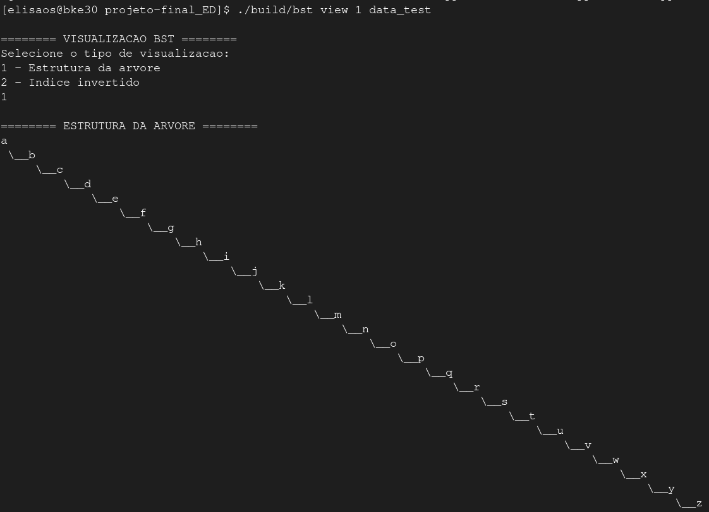
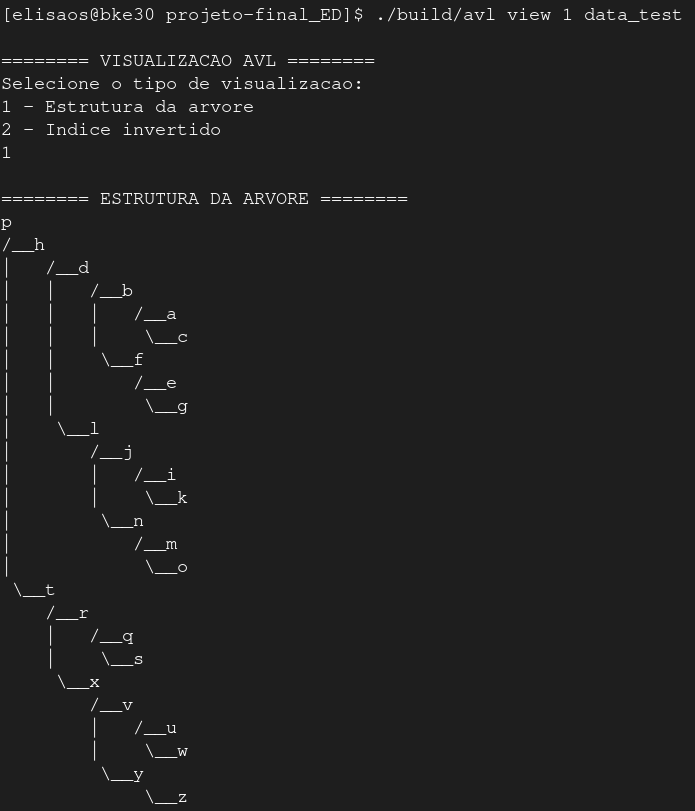
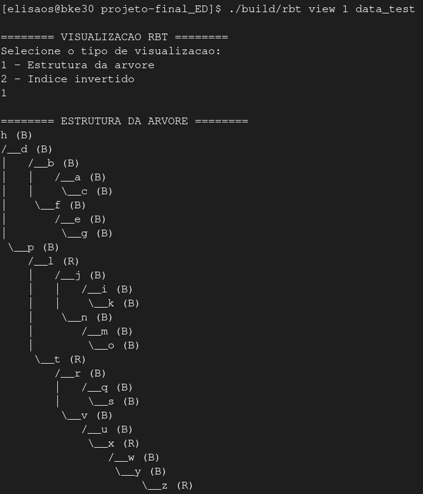

# Trabalho A2: Índice Invertido e Análise Comparativa de Estruturas de Dados

## 1. Introdução

Um **índice invertido** é uma estrutura de dados fundamental em sistemas de recuperação de informação, sendo amplamente utilizada em mecanismos de busca, bancos de dados e aplicações que lidam com grandes volumes de texto. Sua principal finalidade é possibilitar a recuperação eficiente de documentos ou registros que contenham um determinado termo ou conjunto de termos. Nessa estrutura, os dados são organizados por termos (palavras), e cada termo aponta para uma lista de documentos ou páginas da web em que ocorre.

Essa abordagem é especialmente vantajosa em coleções extensas de documentos, onde realizar buscas sequenciais em todos os arquivos seria inviável do ponto de vista computacional. Para além do domínio textual, os índices invertidos também têm aplicações relevantes em áreas como a bioinformática, sendo empregados, especialmente na montagem de sequências de DNA.

Essa estrutura de dados armazena um mapeamento entre conteúdos (como palavras ou números) e suas localizações em um documento ou em um conjunto de documentos. Em outras palavras, isso significa que a estrutura permite responder, perguntas do tipo: “quais documentos contêm o termo X?”, e até mesmo “em quais posições, dentro desses documentos, esse termo aparece?”, dependendo do nível de detalhe adotado.

Existem dois tipos principais de índices invertidos:

**Índice Invertido de Nível de Registro**: associa cada termo a uma lista de documentos nos quais ele aparece, sem indicar a posição exata dentro de cada documento. É mais simples e eficiente em termos de espaço e tempo de processamento, sendo ideal para buscas que não exigem contexto posicional.

**Índice Invertido em Nível de Palavra**: além de listar os documentos em que o termo ocorre, esse tipo de índice também registra as posições exatas de cada ocorrência dentro dos documentos. Embora proporcione funcionalidades adicionais, também demanda uma maior capacidade de armazenamento e processamento para ser criado.

**Vantagens**:

* Maior eficiência em buscas textuais: permite pesquisas rápidas de texto completo, mesmo em grandes volumes de dados, o que o torna ideal para aplicações como mecanismos de busca, ao custo de maior processamento quando um documento é adicionado ao banco de dados.
* Implementação relativamente simples.
* Ampla adoção: é uma das estruturas de dados mais popular em sistemas de recuperação de informação, com aplicações em larga escala em mecanismos de busca.

**Desvantagens**:

* Sobrecarga de armazenamento: especialmente quando se armazenam informações detalhadas como posições das palavras (índice de nível de palavra).
* Custos de manutenção: operações como inserção, exclusão ou atualização de documentos exigem a reconstrução parcial ou completa de listas associadas, o que pode ser computacionalmente caro.
* Ordenação limitada por relevância: os registros são, por padrão, retornados na ordem de ocorrência nas listas invertidas, o que pode não refletir sua relevância ou utilidade esperada exigindo técnicas adicionais de ranqueamento para resultados mais úteis.

O presente relatório apresenta a implementação em C++ de um índice invertido de nível de registro utilizando três diferentes estruturas de dados: Árvore Binária de Busca (BST), Árvore AVL (AVL) e Árvore Rubro-Negra (RBT). O objetivo principal é avaliar e comparar o desempenho dessas estruturas nas operações de inserção e busca de palavras em um corpus textual real.

## 2. Conceitos básicos

Uma **Árvore Binária de Busca (Binary Search Tree - BST)** é uma estrutura de dados em forma de árvore binária que mantém uma propriedade especial de ordenação, permitindo a realização de buscas, inserções e remoções de forma eficiente.

Propriedade fundamental da BST:
Para cada nó da árvore, que armazena uma chave, aplicam-se as seguintes condições:

* Todas as chaves presentes na subárvore esquerda são menores que a chave do nó atual.
* Todas as chaves presentes na subárvore direita são maiores que a chave do nó atual.

As **Árvores AVL** são uma variação das Árvores Binárias de Busca (BSTs) que buscam resolver o problema do desequilíbrio estrutural que pode surgir em inserções ou remoções repetidas. Em uma BST convencional, a árvore pode se tornar degenerada (muito inclinada para um dos lados), o que compromete a eficiência das operações.

A proposta das árvores AVL é manter a árvore **balanceada** automaticamente após cada operação, garantindo que as operações de busca, inserção e remoção mantenham uma complexidade próxima à `O(log n)`.

Para cada nó `n` da árvore, define-se o **fator de balanceamento** (*Balance Factor – BF*) como:
BF(n) = altura(subárvore direita) - altura(subárvore esquerda)

A árvore é considerada balanceada no estilo AVL se, e somente se:
-1 ≤ BF(n) ≤ 1, para todo nó n

Sempre que uma operação causar violação dessa condição, a estrutura da árvore é ajustada automaticamente por meio de **rotações simples ou duplas**, de forma a restaurar o balanceamento.

Uma **árvore rubro-negra** é uma árvore binária de busca que incorpora uma informação adicional em cada nó: sua cor, que pode ser vermelha ou preta. Essa coloração é utilizada para impor regras estruturais que garantem que a árvore permaneça aproximadamente balanceada, mantendo a eficiência das operações básicas (busca, inserção, remoção) com complexidade `O(log n)`.

Uma árvore rubro-negra deve obedecer às seguintes restrições estruturais:

* Todo nó é vermelho ou preto.
* A raiz é sempre preta.
* Todas as folhas (nós NIL) são pretas.
* Se um nó é vermelho, então seus dois filhos (caso existam) são obrigatoriamente pretos.
* Todo caminho simples de um nó até uma folha descendente contém o mesmo número de nós pretos.

Essas propriedades garantem que a árvore tenha uma altura limitada em relação ao número de elementos, mantendo seu desempenho eficiente mesmo após várias operações.

Alguns termos fundamentais que serão abordados ao longo desse relatório:

* Nó: Unidade básica da árvore. Cada nó armazena um valor (ou dado) e ponteiros para seus filhos (outros nós ligados a ele). 
* Raiz: É o nó mais alto da hierarquia, o único que não tem pai. Toda árvore tem exatamente uma raiz. 
* Folha: Nó que não possui filhos.
* Subárvore: Qualquer nó da árvore, junto com seus descendentes. Cada nó define uma subárvore. 

Conceitos estruturais
* Profundidade de um nó: Número de arestas da raiz até esse nó.
* Altura de um nó: Número de arestas no caminho mais longo entre esse nó e uma de suas folhas.

## 3. Divisão de Tarefas

| Nome                        | Tarefa Principal                                                                                |
|-----------------------------|-------------------------------------------------------------------------------------------------|
| Stephany Casali Oliveira    | Implementação da BST (insert e search)  e confecção do relatório                                |
| Samyra Mara Candido Silva   | Implementação da AVL, testes unitários da BST, implementações das funçoes de metricas para gerar os CSVs de analise                                                 |
| Raphaella Roma Mendes Alves | Implementação da RBT e Leitura de dados                                                         |
| Beatriz dos Santos Marques  | Implementação da RBT, Implementação das funções printTree e printIndex, testes unitários da RBT e implementação em Python dos plots para geras graficos e tabelas comparativas|
| Elisa de Oliveira Soares    | CLI (main de todas as árvores), Implementação da create e destroy, testes unitários da AVL e suportes gerais     |

Além das tarefas acima citadas, cada integrante foi responsável por documentar suas próprias funções.

## 4. Estrutura do repositório:

Este projeto está organizado de forma modular para facilitar o desenvolvimento, testes e análise de desempenho das diferentes estruturas de dados usadas na construção de um índice invertido. Abaixo segue a descrição de cada diretório e arquivo:

```
projeto-final_ED/
│
├── src/
│   ├── main_bst.cpp                  # Interface via linha de comando (indexação e busca) da Árvore Binária de Busca
│   ├── main_avl.cpp                  # Interface via linha de comando (indexação e busca) da Árvore AVL
│   ├── main_rbt.cpp                  # Interface via linha de comando (indexação e busca) da Árvore Rubro Negra
│   ├── bst.cpp / bst.h               # Implementação da Árvore Binária de Busca
│   ├── avl.cpp / avl.h               # Implementação da Árvore AVL
│   ├── rbt.cpp / rbt.h               # Implementação da Árvore Rubro-Negra
│   ├── tree_utils.cpp / tree_utils.h # Structs e Funções auxiliares, como Criar Nó, Computar altura, Busca, Exibir Árvore, etc
│   ├── data.cpp / data.h             # Leitura do diretório e carregamento dos arquivos 
│   ├── test_bst.cpp                  # testes unitários e exemplos para implementação da Árvore Binária de Busca
│   ├── test_avl.cpp                  # testes unitários e exemplos para implementação da Árvore AVL
│   ├── test_rbt.cpp                  # testes unitários e exemplos para implementação da Rubro-Negra
│
├── build/                            # Usada para armazenar todos os arquivos executáveis gerados após a compilação
│
├── analysis/
│   ├── analysis_avl.cpp              # Código que executa os testes e coleta dados da AVL
│   ├── analysis_bst.cpp              # Código que executa os testes e coleta dados da BST
│   ├── analysis_rbt.cpp              # Código que executa os testes e coleta dados da RBT
│   ├── metrics.cpp / metrics.h       # Funções auxiliares para coletar métricas (tempos, comparações, altura etc.)
│   ├── Makefile                      # Para compilar os arquivos da pasta analysis
│   ├── results/                 
│   │   ├── CSVs gerados com os dados brutos (.csv)
│   ├── plots/                        # Scripts dos gráficos gerados
│       ├── plot_analysis.py          # Código Python para ler os CSVs e gerar gráficos
│
├── docs/
│   ├── Relatório (PDF ou .md)
│   ├── graphs_tables/                # Usada para armazenar todos gráficos e tabelas gerados nas analises
│
├── data/
│   ├── Base de dados de documentos (.txt)
│
├── data_new/
│   ├── Nova base de dados de documentos (.txt)
│
├── data_test/
│   ├── Nova base de dados de documentos para analise de casos degenerados (.txt)
│
├── Makefile  # Para compilar os arquivos da pasta `src/` e gerar os executáveis na pasta `build/`
│
├── README.md # Descrição, instruções de compilação e execução do Projeto
```

#### `src/`
Contém o código-fonte principal:

- `main_bst.cpp`, `main_avl.cpp`, `main_rbt.cpp`: interfaces de linha de comando para indexação, busca e vizualização para as árvores BST, AVL e RBT respectivamente.
- `bst.cpp`/`bst.h`, `avl.cpp`/`avl.h`, `rbt.cpp`/`rbt.h`: implementações completas das estruturas de árvore.
- `tree_utils.cpp`/`tree_utils.h`: estruturas auxiliares e funções como criação de nós, cálculo de altura, busca, exibição da árvore etc.
- `data.cpp`/`data.h`: responsáveis pela leitura do diretório de dados e carregamento dos arquivos `.txt`.
- `test_bst.cpp`, `test_avl.cpp`, `test_rbt.cpp`: testes unitários para as implementações.

#### `build/`
Armazena os executáveis gerados após a compilação. Mantém o projeto organizado ao separar os binários do código-fonte.

#### `analysis/`
Scripts responsáveis pela coleta de métricas e análise de desempenho:

- `analysis_avl.cpp`, `analysis_bst.cpp`, `analysis_rbt.cpp`: scripts para coleta de dados.
- `metrics.cpp` / `metrics.h`: funções auxiliares e metricas para gerar os CSVs.
- `Makefile`: compila os arquivos da pasta `analysis/`.
- `results/`: arquivos `.csv` contendo os dados brutos coletados durante os testes da analise.
- `plots/`:
  - `plot_analysis.py`: script Python que gera gráficos a partir dos dados em `.csv`.

#### `docs/`
Documentação do projeto:

- `Relatório (PDF ou .md)`: relatório técnico contendo explicações, metodologia, resultados e conclusões.
- `graphs_tables/`: gráficos e tabelas gerados nas análises.

#### `data/`, `data_new/`, `data_test/`
Bases de dados usadas nos experimentos:

- `data/`: base de documentos principal.
- `data_new/`: nova base textual para testes complementares.
- `data_test/`: base com casos degenerados.

#### `Makefile`
Compila os arquivos da pasta `src/`, gerando os executáveis correspondentes na pasta `build/`.

#### `README.md`
Arquivo que contém a descrição geral do projeto, instruções de compilação, execução e explicações sobre a organização do repositório.

## 5. Metodologia

Neste projeto, implementamos um índice invertido em nível de registro, no qual cada termo extraído do corpus textual é associado a uma lista de documentos que o contêm.

### 5.1. Leitura dos Documentos

Para a leitura dos dados dos documentos, utilizamos a classe `ifstream`, fornecida pela biblioteca padrão C++ `<fstream>`. Essa classe permite abrir e manipular arquivos de forma eficiente e estruturada, possibilitando a leitura sequencial de palavras.

No diretorio `src/`, o arquivo `data.cpp` contém as funções responsaveis por leitura, a função `ler_palavras` recebe o caminho de um arquivo e extrai todas as palavras, armazenando-as em um vetor de strings (`std::vector<std::string>`). Esse vetor é então utilizado para representar o conteúdo textual de cada documento.

Para organizar melhor as informações, criamos uma struct chamada `doc`, que contém dois campos principais:

- `id`: identificador único do documento (geralmente um número).
- `words`: vetor contendo todas as palavras extraídas do arquivo.

A função `read_documents` é responsável por percorrer um diretório, abrir sequencialmente um número `n` de arquivos nomeados no formato `"0.txt"`, `"1.txt"`, ..., e carregar seus conteúdos utilizando a função `ler_palavras`. Caso algum arquivo não seja encontrado ou não possa ser aberto, a função emite uma mensagem de erro e continua o processo com o próximo arquivo.

A leitura dos documentos é realizada nos arquivos `main_bst.cpp`, `main_avl.cpp` e `main_rbt.cpp`, localizados no diretório `src/`. Esses arquivos serão explicados em detalhes mais à frente neste relatório. Tambem destacamos o uso das funções de leitura na geração dos CSVs de analises que tambem serao detalhadas mais a frente.

Nossa base de documentos está organizada em diferentes diretórios para facilitar os testes e experimentos:

- **`data/`**: Base principal com 10.103 arquivos `.txt`. Contém textos em português, sem acentuação.
- **`data_new/`**: Base complementar para testes adicionais, com 10.000 arquivos `.txt` em inglês.
- **`data_test/`**: Base para casos degenerados, contendo 2 arquivos `.txt` com letras do alfabeto e números, usada para testar situações específicas.

### 5.2. Estruturas Implementadas

Para a estrutura **BST**, foi necessário implementar as funções `insert`, `search`, `create` e `destroy`, contidas no arquivo `bst.cpp`. Estas funções são responsáveis por inserir palavras na árvore, buscar termos indexados, criar a árvore dinamicamente e liberar a memória ao final da execução.

A função `create` utiliza um bloco `try-catch` para capturar possíveis exceções lançadas pela falha na alocação dinâmica de memória com `new`. Se a alocação falhar, um ponteiro nulo é retornado e uma mensagem de erro é exibida.

A função `insert` percorre a árvore comparando a nova palavra com as palavras já existentes nos nós, a fim de manter a propriedade de ordenação da BST. Se a palavra já estiver presente no nó atual, apenas adiciona o `documentId` correspondente, se ainda não estiver associado. Caso contrário, cria um novo nó na posição correta (esquerda ou direita) e atualiza a altura da árvore com `recomputeHeightTree`.

A função `search` realiza a busca por um termo na árvore, retornando um objeto `SearchResult` contendo informações como:
- Se a palavra foi encontrada (`found`),
- Lista de documentos onde ela aparece (`documentIds`),
- Número de comparações feitas (`numComparisons`),
- Tempo de execução da busca (`executionTime`).

Por fim, a função `destroy` é responsável por liberar os nós da árvore recursivamente, evitando vazamentos de memória.

O arquivo `main_bst.cpp`, localizado em `src/`, implementa a interface de linha de comando da árvore BST. Ele permite executar diferentes comandos para interagir com a árvore: `search`, `stats` e `view`, que serão explicados em detalhes mais à frente neste relatório. A leitura dos arquivos de texto ocorre utilizando a função `read_documents` presente no arquivo `data.cpp`.

A estrutura **AVL** reutiliza as funções `create`, `search` e `destroy` da BST, com adições específicas para manter o balanceamento após inserções:

- `insert`: além da inserção tradicional, invoca a função `rebalance`, que garante a altura balanceada da árvore.
- `rebalance`: avalia o fator de balanceamento de um nó e executa rotações (`rotateLeft`, `rotateRight`) conforme necessário. Utiliza as auxiliares:
  - `transplant`,
  - `getHeight`,
  - `recomputeHeight`,
  - `getBalance`.

Essas operações asseguram complexidade O(log n) para buscas e inserções. O comando `stats` do `main_avl.cpp` pode ser usado para visualizar o impacto do balanceamento.

A **RBT** compartilha a mesma base estrutural das demais, com destaque para a função:

- `fixUp`: aplicada após inserções, é responsável por manter as propriedades da árvore rubro-negra (ex.: raiz preta, ausência de nós vermelhos consecutivos, mesmo número de nós pretos nos caminhos até as folhas).

As demais funções (`create`, `insert`, `search`, `destroy`) seguem a estrutura da BST, com adaptações para manipular cores e garantir o balanceamento automático.

A implementação de linha de comando está em `main_rbt.cpp`, com comandos semelhantes aos das demais estruturas.

## 5.3 Funções Auxiliares (`tree_utils.h`)

As funções auxiliares fornecem suporte essencial à manipulação das estruturas de árvore, abstraindo tarefas recorrentes como criação de nós, rotação, balanceamento e visualização.

### Criação e Liberação de Nós

- `createNode(word, documentId, parent)`: Cria um novo nó com a palavra informada e o identificador do documento. Define ponteiros `left` e `right` como `nullptr` (ou `NIL`), inicia a altura como 0 e define a cor como vermelha (`isRed = 1`), útil para árvores RBT.
- `deleteNode(node, NIL)`: Libera recursivamente a memória alocada para um nó e suas subárvores. Garante que nós `NIL` sejam ignorados, evitando falhas.

### Busca

- `searchNode(tree, word)`: Realiza a busca de uma palavra a partir da raiz da árvore. Retorna um ponteiro para o nó correspondente ou `tree->NIL` caso não seja encontrado.

### Cálculo e Recomputação de Altura

- `getHeight(node, NIL)`: Retorna a altura armazenada no nó, ou -1 se for `NIL`.
- `recomputeHeight(node, NIL)`: Recalcula e atualiza a altura do nó com base na altura de seus filhos.
- `recomputeHeightTree(node, NIL)`: Recalcula a altura de todos os ancestrais de um nó até a raiz (usada na BST). 
- `recomputeHeightTreeIfNeeded(node, NIL)`: Recalcula a altura apenas se for necessário (usada na RBT).

### Balanceamento

- `getBalance(node)`: Retorna o fator de balanceamento de um nó (diferença entre altura da subárvore esquerda e direita).
- `isBalanced(node)`: Verifica recursivamente se todos os nós da árvore estão balanceados (útil para diagnosticar BSTs não balanceadas).
- `rebalance(tree, node)`: Verifica e corrige o balanceamento de um nó até a raiz. Executa rotações simples ou duplas conforme necessário. Retorna o número de rotações realizadas.

### Rotações

- `rotateLeft(tree, x)`: Executa rotação simples à esquerda sobre o nó `x`.
- `rotateRight(tree, y)`: Executa rotação simples à direita sobre o nó `y`.
- `transplant(tree, u, v)`: Substitui o nó `u` pelo nó `v` na estrutura da árvore, atualizando ponteiros dos pais. Usado durante rotações e remoções.

### Verificações para RBT

- `check_no_red_red(node, NIL)`: Verifica se não há dois nós vermelhos consecutivos, garantindo uma das propriedades da árvore rubro-negra.
- `check_black_height(node, NIL, blackHeight, currentHeight)`: Verifica se todos os caminhos da raiz até as folhas possuem o mesmo número de nós pretos (black-height).

### Visualização e Impressão

- `printIndex(tree)`: Percorre a árvore em ordem e imprime o índice de palavras com os IDs dos documentos. Indica se o nó é vermelho (R) ou preto (B), útil para RBTs.
- `printTree(tree)`: Exibe graficamente a estrutura da árvore em texto, com indentação para mostrar os ramos e indicações visuais da hierarquia e da cor dos nós.
- `minDeph(root, NIL)`: Retorna a menor profundidade até uma folha, útil para avaliação estrutural ou estatística da árvore.

## 6. Implementação

### 6.1. Interface de Linha de Comando (CLI)

O programa foi desenvolvido com os seguintes comandos:

```bash
./<arvore> search <n_docs> <diretório>
./<arvore> stats <n_docs> <diretório>
./<arvore> view <n_docs> <diretório>
```
* `<arvore>`: nome do executável da estrutura (ex: bst, avl, rbt)
* `search`: comando que permite realizar buscas por palavras
* `stats`: comando que gera estatísticas de desempenho durante a indexação
* `view` : comando para visualizar a árvore ou o índice invertido
* `<n_docs>`: número de documentos a indexar
* `<diretório>`: caminho para a pasta contendo os arquivos .txt

```bash
./<arvore> search <n_docs> <diretório>:
```
Esse comando inicia o modo de busca por palavras no índice invertido criado com a estrutura de dados selecionada (bst, avl ou rbt). Após a execução, o programa exibe o seguinte prompt interativo:

```bash
Digite "." para sair.
Palavra buscada:
```
O usuário deve então digitar a palavra que deseja buscar. O sistema realiza a busca da palavra na árvore previamente construída a partir dos documentos. Se a palavra for encontrada, o programa retorna:

* Lista de documentos onde a palavra está presente.
* Tempo de busca em milissegundos.
* Número total de comparações realizadas para localizar a palavra.

Se a palavra não estiver presente em nenhum documento, o programa informa que não foi encontrada.
Esse processo se repete até que o usuário digite um ponto (.), encerrando a sessão de busca.

```bash
./<arvore> stats <n_docs> <diretório>:
```
Nesse caso, o comando constrói a árvore de índice invertido a partir dos n_docs documentos localizados no diretório especificado, e em seguida apresenta um conjunto de estatísticas de desempenho da estrutura.
As métricas exibidas incluem:

* Tempo total de leitura dos documentos.
* Tempo total e tempo médio de inserção das palavras na árvore.
* Tempo médio e tempo máximo de busca.
* Número total de comparações realizadas durante inserções e buscas.
* Altura final da árvore construída.
* Comprimento do menor e do maior caminho da raiz até uma folha.
* Número total de nós na árvore.
* Número total de palavras indexadas (com repetição).

```bash
./<arvore> view <n_docs> <diretório>:
```
chama a função `printTree`, e mostra a visualização da árvore com n_docs documentos ou a função `printIndex` que imprime o índice invertido da árvore em ordem alfabética.

Exemplos de Saída
Utilizando o banco de dados presente na pasta `data_test/`, e aplicando cada uma das estruturas já referenciadas neste relatório, obtemos as seguintes representações visuais das árvores:

**BST**



No caso da BST, como a inserção segue uma ordem alfabética simples, a árvore resultante torna-se degenerada à direita. Isso ocorre porque:

- Todas as chaves na subárvore esquerda são menores que a chave do nó atual.
- Todas as chaves na subárvore direita são maiores que a chave do nó atual.

Como consequência, a árvore se comporta como uma lista encadeada, o que prejudica o desempenho em buscas.

**AVL**



Diferentemente da BST, a AVL realiza rotações de balanceamento automaticamente a cada inserção. Isso garante que a altura da árvore permaneça logarítmica, mesmo em casos como inserção ordenada. Como evidenciado na imagem, as subárvores estão equilibradas.

**RBT**



Por fim, a RBT utiliza propriedades de coloração (R = vermelho, B = preto) para garantir que a árvore permaneça aproximadamente balanceada. Ao comparar com as estruturas anteriores:

* A RBT é mais balanceada que a BST, evitando a degeneração.

* No entanto, é menos balanceada que a AVL.


### 6.2 Análise

Além das interfaces de linha de comando, o projeto inclui três programas específicos para análise de desempenho quantitativa das árvores: AVL, BST e RBT. Estes programas estão na pasta `analysis/` e têm como objetivo gerar métricas para diferentes volumes de documentos.

Fluxo de execução dos scripts

1. Abertura de arquivo CSV de resultados
- Cada script cria um arquivo .csv na pasta results/ para armazenar os dados brutos.

2. Leitura dos documentos
- Até 10.000 documentos da pasta data_new/ são lidos usando read_documents().

3. Criação da árvore
- Cada script cria a árvore da respectiva estrutura utilizando: AVL::create(), BST::create() ou RBT::create().

4. Loop de teste incremental
- Para cada faixa de documentos (de 100 a 10.000 documentos, de 100 em 100):

- Insere todas as palavras de cada documento na árvore.
- Após cada inserção, faz uma busca pela mesma palavra.
- Registra métricas de desempenho como:
  - Total de comparações na inserção
  - Tempo total de inserção
  - Número de rotações
  - Total de palavras únicas
  - Total de palavras com repetição
  - Total de comparações durante as buscas
  - Tempo médio de busca
  - Altura da árvore
  - Profundidade mínima e máxima da árvore

5. Cálculo de médias
- Tempo médio de inserção por palavra
- Tempo médio de busca por palavra

6. Gravação dos resultados
- Os resultados de cada etapa são registrados em uma nova linha no CSV.

7. Liberação de memória
- Ao final, a árvore é destruída com as funções destroy() específicas de cada estrutura.

Essa coleta de métricas foi essencial para as comparações apresentadas nas seções de Resultados e Análise Comparativa.

## 7. Resultados

### 7.1. Tabelas de Desempenho

| Estrutura | Tempo Total de Inserção (ms) | Tempo Médio de Busca (ms) | Comparações (Inserção) | Comparações (Busca) | Altura Média |
|-----------|------------------------------|---------------------------|------------------------|---------------------|--------------|
| BST       |                              |                           |                        |                     |              |
| AVL       |                              |                           |                        |                     |              |
| RBT       |                              |                           |                        |                     |              |

Pequeno texto adicional **aqui**
### 7.2. Gráficos

Inserir **aqui** os gráficos comparativos (tempo, altura, comparações, etc.).

## 8. Análise Comparativa

- **BST**: [vantagens e limitações observadas]
- **AVL**: [vantagens e limitações observadas]
- **RBT**: [vantagens e limitações observadas]

Discussão sobre **aqui**:
- Eficiência nas operações
- Comportamento com diferentes volumes de dados
- Impacto da altura da árvore
- Outros critérios relevantes

## 9. Dificuldades Encontradas

Inicialmente, enfrentamos desafios na definição da estrutura de dados ideal para armazenar as palavras extraídas dos documentos. Após discutir diferentes abordagens, decidimos criar uma struct chamada docs, contendo o ID do documento e um vetor com todos os termos extraídos.

Na BST, tivemos dificuldades para calcular corretamente a altura da árvore, o que foi solucionado com a implementação da função `recomputeHeightTree`.

Para a AVL, encontramos uma grande dificuldade em entender o comportamento do balanceamento da árvore como um todo. Em especial, nos questionamos se a diferença entre o maior e o menor galho (ou seja, entre as profundidades das folhas mais distantes) poderia ser maior do que 1. Isso, pois, a regra fundamental da AVL exige que, para todo nó, a diferença entre as alturas de suas subárvores esquerda e direita seja no máximo 1. No entanto, essa condição é local: ela se aplica a cada nó individualmente, e não à árvore inteira. Assim, é possível que a diferença entre o caminho mais curto e o mais longo da árvore exceda 1, desde que todos os nós intermediários respeitem o fator de balanceamento definido. Por exemplo,

```mathematica
          ●
        /   \
      ●       ●
     / \     /  \
    ●   ●   ●    ●
   /       / \    \
  ●       ●   ●    ●
         / \
        ●   ●
```

uma arvore balanceada com galho menor 3 e galho maior 5.

Na RBT, a função `fixUp` representou o maior obstáculo, exigindo um bom entendimento dos casos em que rotações e trocas de cor devem ser aplicadas para preservar as propriedades da árvore rubro-negra.

Quanto à CLI, a principal dificuldade esteve na estruturação da lógica de funcionamento, principalmente no tratamento de erros e na validação de argumentos. Foi necessário implementar verificações para evitar argumentos inválidos, comandos desconhecidos ou diretórios inexistentes.

## 10. Conclusão

**aqui**

## 11. Referências

[1] GeeksforGeeks. *Inverted Index*. Disponível em: [https://www.geeksforgeeks.org/inverted-index/](https://www.geeksforgeeks.org/inverted-index/). Acesso em: 16 jun. 2025.

[2] Wikipedia. *Inverted index*. Disponível em: [https://en.wikipedia.org/wiki/Inverted_index](https://en.wikipedia.org/wiki/Inverted_index). Acesso em: 16 jun. 2025.


---

> **Data de Entrega:** 18/06/2025  
> **Professor:** Matheus Werner 
> **Disciplina:** Estrutura de dados
