# Trabalho A2: Índice Invertido e Análise Comparativa de Estruturas de Dados

## 1. Introdução

Um **índice invertido** é uma estrutura de dados fundamental em sistemas de recuperação de informação, sendo amplamente utilizada em mecanismos de busca, bancos de dados e aplicações que lidam com grandes volumes de texto. Sua principal finalidade é possibilitar a recuperação eficiente de documentos ou registros que contenham um determinado termo ou conjunto de termos. Nessa estrutura, os dados são organizados por termos (palavras), e cada termo aponta para uma lista de documentos ou páginas da web em que ocorre.

Essa abordagem é especialmente vantajosa em coleções extensas de documentos, onde realizar buscas sequenciais em todos os arquivos seria inviável do ponto de vista computacional. Para além do domínio textual, os índices invertidos também têm aplicações relevantes em áreas como a bioinformática, sendo empregados, especialmente na montagem de sequências de DNA.

Essa estrutura de dados armazena um mapeamento entre conteúdos (como palavras ou números) e suas localizações em um documento ou em um conjunto de documentos. Em outras palavras, isso significa que a estrutura permite responder, perguntas do tipo: “quais documentos contêm o termo X?”, e até mesmo “em quais posições, dentro desses documentos, esse termo aparece?”, dependendo do nível de detalhe adotado.

Existem dois tipos principais de índices invertidos:

**Índice Invertido de Nível de Registro**: associa cada termo a uma lista de documentos nos quais ele aparece, sem indicar a posição exata dentro de cada documento. É mais simples e eficiente em termos de espaço e tempo de processamento, sendo ideal para buscas que não exigem contexto posicional.

**Índice Invertido em Nível de Palavra**: além de listar os documentos em que o termo ocorre, esse tipo de índice também registra as posições exatas de cada ocorrência dentro dos documentos. Embora proporcione funcionalidades adicionais, também demanda uma maior capacidade de armazenamento e processamento para ser criado.

**Vantagens**:

* Maior eficiência em buscas textuais: permite pesquisas rápidas de texto completo, mesmo em grandes volumes de dados, o que o torna ideal para aplicações como mecanismos de busca, ao custo de maior processamento quando um documento é adicionado ao banco de dados.
* Implementação relativamente simples.
* Ampla adoção: é uma das estruturas de dados mais popular em sistemas de recuperação de informação, com aplicações em larga escala em mecanismos de busca.

**Desvantagens**:

* Sobrecarga de armazenamento: especialmente quando se armazenam informações detalhadas como posições das palavras (índice de nível de palavra).
* Custos de manutenção: operações como inserção, exclusão ou atualização de documentos exigem a reconstrução parcial ou completa de listas associadas, o que pode ser computacionalmente caro.
* Ordenação limitada por relevância: os registros são, por padrão, retornados na ordem de ocorrência nas listas invertidas, o que pode não refletir sua relevância ou utilidade esperada exigindo técnicas adicionais de ranqueamento para resultados mais úteis.

O presente relatório apresenta a implementação em C++ de um índice invertido de nível de registro utilizando três diferentes estruturas de dados: Árvore Binária de Busca (BST), Árvore AVL (AVL) e Árvore Rubro-Negra (RBT). O objetivo principal é avaliar e comparar o desempenho dessas estruturas nas operações de inserção e busca de palavras em um corpus textual real.

## 2. Conceitos básicos

Uma **Árvore Binária de Busca (Binary Search Tree - BST)** é uma estrutura de dados em forma de árvore binária que mantém uma propriedade especial de ordenação, permitindo a realização de buscas, inserções e remoções de forma eficiente.

Propriedade fundamental da BST:
Para cada nó da árvore, que armazena uma chave, aplicam-se as seguintes condições:

* Todas as chaves presentes na subárvore esquerda são menores que a chave do nó atual.
* Todas as chaves presentes na subárvore direita são maiores que a chave do nó atual.

As **Árvores AVL** são uma variação das Árvores Binárias de Busca (BSTs) que buscam resolver o problema do desequilíbrio estrutural que pode surgir em inserções ou remoções repetidas. Em uma BST convencional, a árvore pode se tornar degenerada (muito inclinada para um dos lados), o que compromete a eficiência das operações.

A proposta das árvores AVL é manter a árvore **balanceada** automaticamente após cada operação, garantindo que as operações de busca, inserção e remoção mantenham uma complexidade próxima à `O(log n)`.

Para cada nó `n` da árvore, define-se o **fator de balanceamento** (*Balance Factor – BF*) como:
BF(n) = altura(subárvore direita) - altura(subárvore esquerda)

A árvore é considerada balanceada no estilo AVL se, e somente se:
-1 ≤ BF(n) ≤ 1, para todo nó n

Sempre que uma operação causar violação dessa condição, a estrutura da árvore é ajustada automaticamente por meio de **rotações simples ou duplas**, de forma a restaurar o balanceamento.

Uma **Árvore Rubro-Negra** é uma árvore binária de busca que incorpora uma informação adicional em cada nó: sua cor, que pode ser vermelha ou preta. Essa coloração é utilizada para impor regras estruturais que garantem que a árvore permaneça aproximadamente balanceada, mantendo a eficiência das operações básicas (busca, inserção, remoção) com complexidade `O(log n)`.

Uma árvore rubro-negra deve obedecer às seguintes restrições estruturais:

* Todo nó é vermelho ou preto.
* A raiz é sempre preta.
* Todas as folhas (nós NIL) são pretas.
* Se um nó é vermelho, então seus dois filhos (caso existam) são obrigatoriamente pretos.
* Todo caminho simples de um nó até uma folha descendente contém o mesmo número de nós pretos.

Essas propriedades garantem que a árvore tenha uma altura limitada em relação ao número de elementos, mantendo seu desempenho eficiente mesmo após várias operações.

Alguns termos fundamentais que serão abordados ao longo desse relatório:

* Nó: Unidade básica da árvore. Cada nó armazena um valor (ou dado) e ponteiros para seus filhos (outros nós ligados a ele). 
* Raiz: É o nó mais alto da hierarquia, o único que não tem pai. Toda árvore tem exatamente uma raiz. 
* Folha: Nó que não possui filhos.
* Subárvore: Qualquer nó da árvore, junto com seus descendentes. Cada nó define uma subárvore. 

Conceitos estruturais
* Profundidade de um nó: Número de arestas da raiz até esse nó.
* Altura de um nó: Número de arestas no caminho mais longo entre esse nó e uma de suas folhas.

## 3. Divisão de Tarefas

| Nome                        | Tarefa Principal                                                                                |
|-----------------------------|-------------------------------------------------------------------------------------------------|
| Stephany Casali Oliveira    | Implementação da BST (insert e search)  e confecção do relatório                                |
| Samyra Mara Candido Silva   | Implementação da AVL, testes unitários da BST, implementações das funções de métricas para gerar os CSVs de analise                                                 |
| Raphaella Roma Mendes Alves | Implementação da RBT e Leitura de dados                                                         |
| Beatriz dos Santos Marques  | Implementação da RBT, Implementação das funções printTree e printIndex, testes unitários da RBT e implementação em Python dos plots para gerar gráficos e tabelas comparativas|
| Elisa de Oliveira Soares    | CLI (main de todas as árvores), Implementação da create e destroy, testes unitários da AVL e suportes gerais     |

Além das tarefas acima citadas, cada integrante foi responsável por documentar suas próprias funções.

## 4. Estrutura do repositório:

Este projeto está organizado de forma modular para facilitar o desenvolvimento, testes e análise de desempenho das diferentes estruturas de dados usadas na construção de um índice invertido. Abaixo segue a descrição de cada diretório e arquivo:

```
projeto-final_ED/
│
├── src/
│   ├── main_bst.cpp                  # Interface via linha de comando (indexação e busca) da Árvore Binária de Busca
│   ├── main_avl.cpp                  # Interface via linha de comando (indexação e busca) da Árvore AVL
│   ├── main_rbt.cpp                  # Interface via linha de comando (indexação e busca) da Árvore Rubro Negra
│   ├── bst.cpp / bst.h               # Implementação da Árvore Binária de Busca
│   ├── avl.cpp / avl.h               # Implementação da Árvore AVL
│   ├── rbt.cpp / rbt.h               # Implementação da Árvore Rubro-Negra
│   ├── tree_utils.cpp / tree_utils.h # Structs e Funções auxiliares, como Criar Nó, Computar altura, Busca, Exibir Árvore, etc
│   ├── data.cpp / data.h             # Leitura do diretório e carregamento dos arquivos 
│   ├── test_bst.cpp                  # testes unitários e exemplos para implementação da Árvore Binária de Busca
│   ├── test_avl.cpp                  # testes unitários e exemplos para implementação da Árvore AVL
│   ├── test_rbt.cpp                  # testes unitários e exemplos para implementação da Rubro-Negra
│
├── build/                            # Usada para armazenar todos os arquivos executáveis gerados após a compilação
│
├── analysis/
│   ├── analysis_avl.cpp              # Código que executa os testes e coleta dados da AVL
│   ├── analysis_bst.cpp              # Código que executa os testes e coleta dados da BST
│   ├── analysis_rbt.cpp              # Código que executa os testes e coleta dados da RBT
│   ├── analysis_general.cpp          # Código que executa a coleta de dados até 100 e grava no CSV para todos
│   ├── metrics.cpp / metrics.h       # Funções auxiliares para coletar métricas (tempos, comparações, altura etc.)
│   ├── Makefile                      # Para compilar os arquivos da pasta analysis
│   ├── results/                 
│   │   ├── CSVs gerados com os dados brutos (.csv)
│   ├── plots/                        # Scripts dos gráficos gerados
│       ├── plot_analysis.ipynb       # Código Jupyter em python para ler os CSVs e gerar gráficos
│
├── docs/
│   ├── Relatório.md
│   ├── graphs_tables/                # Usada para armazenar todos gráficos e tabelas gerados nas analises
│
├── data/
│   ├── Base de dados de documentos (.txt)
│
├── data_new/
│   ├── Nova base de dados de documentos (.txt)
│
├── data_test/
│   ├── Nova base de dados de documentos para análise de casos degenerados (.txt)
│
├── Makefile  # Para compilar os arquivos da pasta `src/` e gerar os executáveis na pasta `build/`
│
├── README.md # Descrição, instruções de compilação e execução do Projeto
```

#### `src/`
Contém o código-fonte principal:

- `main_bst.cpp`, `main_avl.cpp`, `main_rbt.cpp`, `analysis_general.cpp`: interfaces de linha de comando para indexação, busca e visualização para as árvores BST, AVL e RBT respectivamente.
- `bst.cpp`/`bst.h`, `avl.cpp`/`avl.h`, `rbt.cpp`/`rbt.h`: implementações completas das estruturas de árvore.
- `tree_utils.cpp`/`tree_utils.h`: estruturas auxiliares e funções como criação de nós, cálculo de altura, busca, exibição da árvore etc.
- `data.cpp`/`data.h`: responsáveis pela leitura do diretório de dados e carregamento dos arquivos `.txt`.
- `test_bst.cpp`, `test_avl.cpp`, `test_rbt.cpp`: testes unitários para as implementações.

#### `build/`
Armazena os executáveis gerados após a compilação. Mantém o projeto organizado ao separar os binários do código-fonte.

#### `analysis/`
Scripts responsáveis pela coleta de métricas e análise de desempenho:

- `analysis_avl.cpp`, `analysis_bst.cpp`, `analysis_rbt.cpp`: scripts para coleta de dados.
- `metrics.cpp` / `metrics.h`: funções auxiliares e métricas para gerar os CSVs.
- `Makefile`: compila os arquivos da pasta `analysis/`.
- `results/`: arquivos `.csv` contendo os dados brutos coletados durante os testes da análise.
- `plots/`:
  - `plot_analysis.ipynb`: Código Jupyter em python para ler os CSVs e gerar gráficos

#### `docs/`
Documentação do projeto:

- `Relatório.md`: relatório técnico contendo explicações, metodologia, resultados e conclusões.
- `graphs_tables/`: gráficos e tabelas gerados nas análises.

#### `data/`, `data_new/`, `data_test/`
Bases de dados usadas nos experimentos:

- `data/`: base de documentos principal.
- `data_new/`: nova base textual para testes complementares.
- `data_test/`: base com casos degenerados.

#### `Makefile`
Compila os arquivos da pasta `src/`, gerando os executáveis correspondentes na pasta `build/`.

#### `README.md`
Arquivo que contém a descrição geral do projeto, instruções de compilação, execução e explicações sobre a organização do repositório.

## 5. Metodologia

Neste projeto, implementamos um índice invertido em nível de registro, no qual cada termo extraído do corpus textual é associado a uma lista de documentos que o contêm.

### 5.1. Leitura dos Documentos

Para a leitura dos dados dos documentos, utilizamos a classe `ifstream`, fornecida pela biblioteca padrão C++ `<fstream>`. Essa classe permite abrir e manipular arquivos de forma eficiente e estruturada, possibilitando a leitura sequencial de palavras.

No diretório `src/`, o arquivo `data.cpp` contém as funções responsáveis por leitura, a função `ler_palavras` recebe o caminho de um arquivo e extrai todas as palavras, armazenando-as em um vetor de strings (`std::vector<std::string>`). Esse vetor é então utilizado para representar o conteúdo textual de cada documento.

Para organizar melhor as informações, criamos uma struct chamada `doc`, que contém dois campos principais:

- `id`: identificador único do documento (geralmente um número).
- `words`: vetor contendo todas as palavras extraídas do arquivo.

A função `read_documents` é responsável por percorrer um diretório, abrir sequencialmente um número `n` de arquivos nomeados no formato `"0.txt"`, `"1.txt"`, ..., e carregar seus conteúdos utilizando a função `ler_palavras`. Caso algum arquivo não seja encontrado ou não possa ser aberto, a função emite uma mensagem de erro e continua o processo com o próximo arquivo.

A leitura dos documentos é realizada nos arquivos `main_bst.cpp`, `main_avl.cpp` e `main_rbt.cpp`, localizados no diretório `src/`. Esses arquivos serão explicados em detalhes mais à frente neste relatório. Também destacamos o uso das funções de leitura na geração dos CSVs de analises que também serão detalhadas mais a frente.

Nossa base de documentos está organizada em diferentes diretórios para facilitar os testes e experimentos:

- **`data/`**: Base principal com 10.103 arquivos `.txt`. Contém textos em português, sem acentuação.
- **`data_new/`**: Base complementar para testes adicionais, com 10.000 arquivos `.txt` em inglês.
- **`data_test/`**: Base para casos degenerados, contendo 2 arquivos `.txt` com letras do alfabeto e números, usada para testar situações específicas.

### 5.2. Estruturas Implementadas

Para a estrutura **BST**, foi necessário implementar as funções `insert`, `search`, `create` e `destroy`, contidas no arquivo `bst.cpp`. Estas funções são responsáveis por inserir palavras na árvore, buscar termos indexados, criar a árvore dinamicamente e liberar a memória ao final da execução.

A função `create` utiliza um bloco `try-catch` para capturar possíveis exceções lançadas pela falha na alocação dinâmica de memória com `new`. Se a alocação falhar, um ponteiro nulo é retornado e uma mensagem de erro é exibida.

A função `insert` percorre a árvore comparando a nova palavra com as palavras já existentes nos nós, a fim de manter a propriedade de ordenação da BST. Se a palavra já estiver presente no nó atual, apenas adiciona o `documentId` correspondente, se ainda não estiver associado. Caso contrário, cria um novo nó na posição correta (esquerda ou direita) e atualiza a altura da árvore com `recomputeHeightTree`.

A função `search` realiza a busca por um termo na árvore, retornando um objeto `SearchResult` contendo informações como:
- Se a palavra foi encontrada (`found`),
- Lista de documentos onde ela aparece (`documentIds`),
- Número de comparações feitas (`numComparisons`),
- Tempo de execução da busca (`executionTime`).

Por fim, a função `destroy` é responsável por liberar os nós da árvore recursivamente, evitando vazamentos de memória.

O arquivo `main_bst.cpp`, localizado em `src/`, implementa a interface de linha de comando da árvore BST. Ele permite executar diferentes comandos para interagir com a árvore: `search`, `stats` e `view`, que serão explicados em detalhes mais à frente neste relatório. A leitura dos arquivos de texto ocorre utilizando a função `read_documents` presente no arquivo `data.cpp`.

A estrutura **AVL** reutiliza as funções `create`, `search` e `destroy` da BST, com adições específicas para manter o balanceamento após inserções:

- `insert`: além da inserção tradicional, invoca a função `rebalance`, que garante a altura balanceada da árvore.
- `rebalance`: avalia o fator de balanceamento de um nó e executa rotações (`rotateLeft`, `rotateRight`) conforme necessário. Utiliza as auxiliares:
  - `transplant`,
  - `getHeight`,
  - `recomputeHeight`,
  - `getBalance`.

Essas operações asseguram complexidade O(log n) para buscas e inserções. O comando `stats` do `main_avl.cpp` pode ser usado para visualizar o impacto do balanceamento.

A **RBT** compartilha a mesma base estrutural das demais, com destaque para a função:

- `fixUp`: aplicada após inserções, é responsável por manter as propriedades da árvore rubro-negra (ex.: raiz preta, ausência de nós vermelhos consecutivos, mesmo número de nós pretos nos caminhos até as folhas).

As demais funções (`create`, `insert`, `search`, `destroy`) seguem a estrutura da BST, com adaptações para manipular cores e garantir o balanceamento automático.

A implementação de linha de comando está em `main_rbt.cpp`, com comandos semelhantes aos das demais estruturas.

## 5.3 Funções Auxiliares (`tree_utils.h`)

As funções auxiliares fornecem suporte essencial à manipulação das estruturas de árvore, abstraindo tarefas recorrentes como criação de nós, rotação, balanceamento e visualização.

### Criação e Liberação de Nós

- `createNode(word, documentId, parent)`: Cria um novo nó com a palavra informada e o identificador do documento. Define ponteiros `left` e `right` como `nullptr` (ou `NIL`), inicia a altura como 0 e define a cor como vermelha (`isRed = 1`), útil para árvores RBT.
- `deleteNode(node, NIL)`: Libera recursivamente a memória alocada para um nó e suas subárvores. Garante que nós `NIL` sejam ignorados, evitando falhas.

### Busca

- `searchNode(tree, word)`: Realiza a busca de uma palavra a partir da raiz da árvore. Retorna um ponteiro para o nó correspondente ou `tree->NIL` caso não seja encontrado.

### Cálculo e Recomputação de Altura

- `getHeight(node, NIL)`: Retorna a altura armazenada no nó, ou -1 se for `NIL`.
- `recomputeHeight(node, NIL)`: Recalcula e atualiza a altura do nó com base na altura de seus filhos.
- `recomputeHeightTree(node, NIL)`: Recalcula a altura de todos os ancestrais de um nó até a raiz (usada na BST). 
- `recomputeHeightTreeIfNeeded(node, NIL)`: Recalcula a altura apenas se for necessário (usada na RBT).

### Balanceamento

- `getBalance(node)`: Retorna o fator de balanceamento de um nó (diferença entre altura da subárvore esquerda e direita).
- `isBalanced(node)`: Verifica recursivamente se todos os nós da árvore estão balanceados (útil para diagnosticar BSTs não balanceadas).
- `rebalance(tree, node)`: Verifica e corrige o balanceamento de um nó até a raiz. Executa rotações simples ou duplas conforme necessárias. Retorna o número de rotações realizadas.

### Rotações

- `rotateLeft(tree, x)`: Executa rotação simples à esquerda sobre o nó `x`.
- `rotateRight(tree, y)`: Executa rotação simples à direita sobre o nó `y`.
- `transplant(tree, u, v)`: Substitui o nó `u` pelo nó `v` na estrutura da árvore, atualizando ponteiros dos pais. Usado durante rotações e remoções.

### Verificações para RBT

- `check_no_red_red(node, NIL)`: Verifica se não há dois nós vermelhos consecutivos, garantindo uma das propriedades da árvore rubro-negra.
- `check_black_height(node, NIL, blackHeight, currentHeight)`: Verifica se todos os caminhos da raiz até as folhas possuem o mesmo número de nós pretos (black-height).

### Visualização e Impressão

- `printIndex(tree)`: Percorre a árvore em ordem e imprime o índice de palavras com os IDs dos documentos.
- `printTree(tree)`: Exibe graficamente a estrutura da árvore em texto, com indentação para mostrar os ramos e indicações visuais da hierarquia e da cor dos nós.
- `minDeph(root, NIL)`: Retorna a menor profundidade até uma folha, útil para avaliação estrutural ou estatística da árvore.

## 6. Implementação

### 6.1. Interface de Linha de Comando (CLI)

O programa foi desenvolvido com os seguintes comandos:

```bash
./<arvore> search <n_docs> <diretório>
./<arvore> stats <n_docs> <diretório>
./<arvore> view <n_docs> <diretório>
```
* `<arvore>`: nome do executável da estrutura (ex: bst, avl, rbt)
* `search`: comando que permite realizar buscas por palavras
* `stats`: comando que gera estatísticas de desempenho durante a indexação
* `view` : comando para visualizar a árvore ou o índice invertido
* `<n_docs>`: número de documentos a indexar
* `<diretório>`: caminho para a pasta contendo os arquivos .txt

```bash
./<arvore> search <n_docs> <diretório>:
```
Esse comando inicia o modo de busca por palavras no índice invertido criado com a estrutura de dados selecionada (bst, avl ou rbt). Após a execução, o programa exibe o seguinte prompt interativo:

```bash
Digite "." para sair.
Palavra buscada:
```
O usuário deve então digitar a palavra que deseja buscar. O sistema realiza a busca da palavra na árvore previamente construída a partir dos documentos. Se a palavra for encontrada, o programa retorna:

* Lista de documentos onde a palavra está presente.
* Tempo de busca em milissegundos.
* Número total de comparações realizadas para localizar a palavra.

Se a palavra não estiver presente em nenhum documento, o programa informa que não foi encontrada.
Esse processo se repete até que o usuário digite um ponto (.), encerrando a sessão de busca.

```bash
./<arvore> stats <n_docs> <diretório>:
```
Nesse caso, o comando constrói a árvore de índice invertido a partir dos n_docs documentos localizados no diretório especificado, e em seguida apresenta um conjunto de estatísticas de desempenho da estrutura.
As métricas exibidas incluem:

* Tempo total de leitura dos documentos.
* Tempo total e tempo médio de inserção das palavras na árvore.
* Tempo médio e tempo máximo de busca.
* Número total de comparações realizadas durante inserções e buscas.
* Altura final da árvore construída.
* Comprimento do menor e do maior caminho da raiz até uma folha.
* Número total de nós na árvore.
* Número total de palavras indexadas (com repetição).

```bash
./<arvore> view <n_docs> <diretório>:
```
Chama a função `printTree`, e mostra a visualização da árvore com n_docs documentos ou a função `printIndex` que imprime o índice invertido da árvore em ordem alfabética.

Exemplos de Saída
Utilizando o banco de dados presente na pasta `data_test/`, e aplicando cada uma das estruturas já referenciadas neste relatório, obtemos as seguintes representações visuais das árvores:

**BST**


No caso da BST, como a inserção segue uma ordem alfabética simples, a árvore resultante torna-se degenerada à direita. Isso ocorre porque:

- Todas as chaves na subárvore esquerda são menores que a chave do nó atual.
- Todas as chaves na subárvore direita são maiores que a chave do nó atual.

Como consequência, a árvore se comporta como uma lista encadeada, o que prejudica o desempenho em buscas.

**AVL**


Diferentemente da BST, a AVL realiza rotações de balanceamento automaticamente a cada inserção. Isso garante que a altura da árvore permaneça logarítmica, mesmo em casos como inserção ordenada. Como evidenciado na imagem, as subárvores estão equilibradas.

**RBT**


Por fim, a RBT utiliza propriedades de coloração (R = vermelho, B = preto) para garantir que a árvore permaneça aproximadamente balanceada. Ao comparar com as estruturas anteriores:

* A RBT é mais balanceada que a BST, evitando a degeneração.

* No entanto, é menos balanceada que a AVL.


### 6.2 Análise

Além das interfaces de linha de comando, o projeto inclui três programas específicos para análise de desempenho quantitativa das árvores: AVL, BST e RBT. Estes programas estão na pasta `analysis/` e têm como objetivo gerar métricas para diferentes volumes de documentos.

Fluxo de execução dos scripts

1. Abertura de arquivo CSV de resultados
- Cada script cria um arquivo .csv na pasta results/ para armazenar os dados brutos.

2. Leitura dos documentos
- Até 10.000 documentos da pasta data_new/ são lidos usando read_documents().

3. Criação da árvore
- Cada script cria a árvore da respectiva estrutura utilizando: AVL::create(), BST::create() ou RBT::create().

4. Loop de teste incremental
- Para cada faixa de documentos (de 100 a 10.000 documentos, de 100 em 100):

- Insere todas as palavras de cada documento na árvore.
- Após cada inserção, faz uma busca pela mesma palavra.
- Registra métricas de desempenho como:
  - Total de comparações na inserção
  - Tempo total de inserção
  - Número de rotações
  - Total de palavras únicas
  - Total de palavras com repetição
  - Total de comparações durante as buscas
  - Tempo médio de busca
  - Altura da árvore
  - Profundidade mínima e máxima da árvore

5. Cálculo de médias
- Tempo médio de inserção por palavra
- Tempo médio de busca por palavra

6. Gravação dos resultados
- Os resultados de cada etapa são registrados em uma nova linha no CSV.

7. Liberação de memória
- Ao final, a árvore é destruída com as funções destroy() específicas de cada estrutura.

Essa coleta de métricas foi essencial para as comparações apresentadas nas seções de Resultados e Análise Comparativa.

## 7. Resultados

### 7.1. Tabelas de Desempenho

Para a tabela de desempenho a seguir, foram considerados os dados obtidos após a inserção de **10.000 documentos** da base de dados presente no diretório `data_new/`, conforme registrado nos arquivos CSV gerados durante os testes.

| Estrutura | Tempo Total de Inserção (ms) | Tempo Médio de Busca (ms) | Comparações (Inserção) | Comparações (Busca) | Altura |
|-----------|------------------------------|---------------------------|------------------------|---------------------|--------|
| BST       |         249763.682006        |          0.000481         |       412032644        |      412232508      |   45   |
| AVL       |         266174.909117        |          0.000556         |       401436310        |      401509211      |   20   |
| RBT       |         258220.942663        |          0.000555         |       402110830        |      402199837      |   21   |

- A **BST** apresenta o menor tempo total de inserção, mas ao custo de uma **altura muito elevada**, o que gera um número significativamente maior de comparações.
- A **AVL**, embora tenha o maior tempo de inserção, apresenta a **menor altura**, o que favorece buscas rápidas e estáveis.
- A **RBT** surge como uma solução de equilíbrio, com desempenho próximo ao da AVL em buscas, mas com inserções mais eficientes que a AVL e altura apenas ligeiramente superior.

### 7.2. Gráficos

Para comparar o desempenho e as características estruturais das árvores **BST**, **AVL** e **RBT**, foram gerados gráficos com base em dados coletados durante a execução do programa em C++.

Durante os testes, o programa processou diferentes quantidades de documentos e registrou diversas métricas, como **tempo de inserção e busca**, **número de comparações**, **altura da árvore**, **tamanho dos galhos**, **número de rotações** e **número de palavras distintas**. Os dados foram exportados em arquivos CSV e analisados com Python (`pandas`, `NumPy` e `matplotlib`).

Os gráficos consideram aumentos de 1000 em 1000 documentos, iniciando em 100 até chegar a 10.000. Em alguns casos, utilizamos o número de palavras distintas (nós) como referência no eixo X. Também foi criado um CSV adicional com dados dos primeiros 100 documentos para análise mais detalhada em menor escala.

### 7.2.1 Crescimento de palavras com o numero de documentos

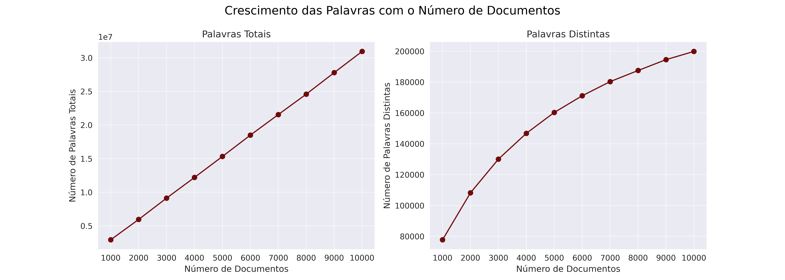

Observa-se que o número total de palavras é praticamente constante entre os documentos. No entanto, conforme mais documentos são analisados, grande parte das palavras já terá sido inserida anteriormente. Por isso, o número de **palavras distintas** cresce de forma mais lenta ao longo do tempo.

Isso significa que, para os documentos mais recentes, muitas palavras não geram a criação de novos nós, mas sim a **atualização dos nós existentes** com a inclusão do novo identificador de documento.

### 7.2.2 Número de Rotações

As imagens a seguir apresentam o número total de rotações realizadas por cada estrutura balanceada **AVL** e **RBT**:

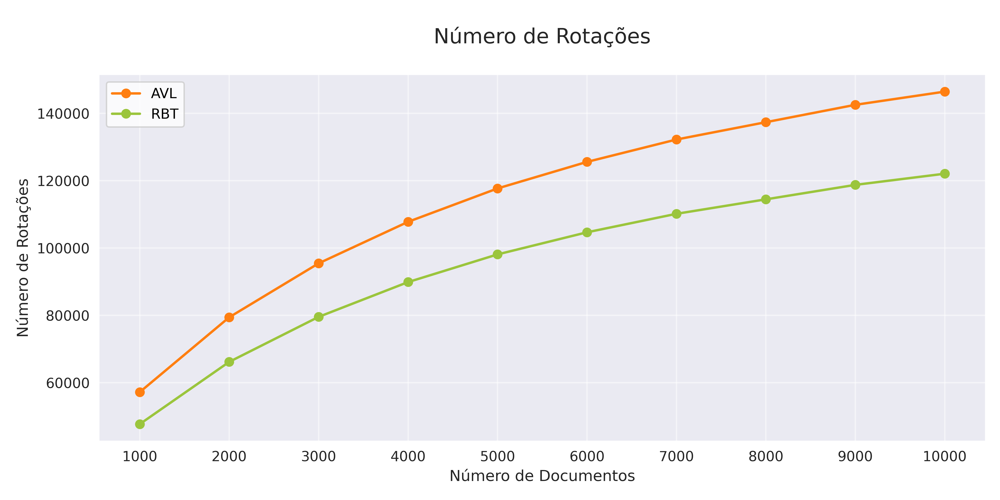
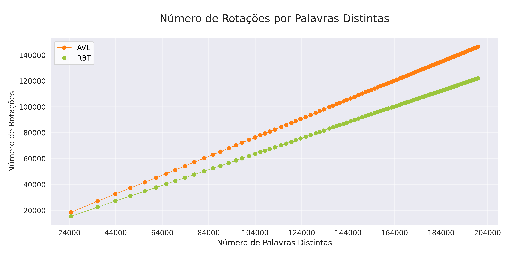

#### AVL

- **Comportamento esperado:**
  - A AVL como dito anteriormente, exige **rotações frequentes** (simples ou duplas) a cada inserção que desequilibre a árvore.
  - Portanto, espera-se que o **número de rotações** cresça significativamente com o aumento de documentos.

- **Comportamento observado:**
  - A AVL apresentou o **maior número de rotações em todos os cenários**.
  - Isso reforça a explicação sobre o maior custo de inserção associado à estrutura AVL, que será feita mais a frente nesse relatório.

#### RBT

- **Comportamento esperado:**
  - A RBT utiliza regras de balanceamento mais flexíveis, realizando **menos rotações** em comparação à AVL.
  - Espera-se um crescimento mais suave no número de rotações à medida que o número de documentos aumenta.

- **Comportamento observado:**
  - O número de rotações na RBT foi **significativamente menor que na AVL**, confirmando o comportamento esperado.
  
### Relação entre Número de Rotações e Tempo Total de Inserção

O gráfico a seguir mostra a relação entre o **número de rotações realizadas** e o **tempo total de inserção**, destacando como o custo estrutural afeta o desempenho prático:

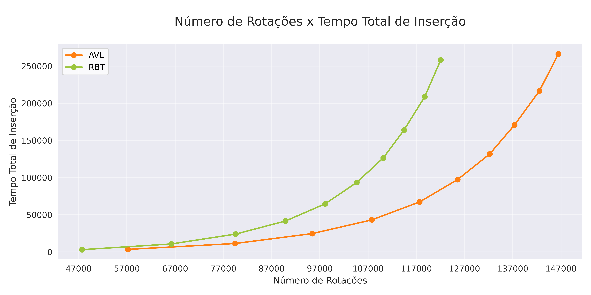

- **AVL**: Como previsto, teve o maior tempo de inserção, reflexo direto de seu balanceamento estrito via rotações frequentes.

- **RBT**: Aparentemente mais eficiente em rotações, mas **com maior custo por rotação** quando o volume de dados é alto, o que pode estar relacionado à complexidade extra na manutenção das propriedades da RBT.

### 7.2.3 Tempo de inserção por documento

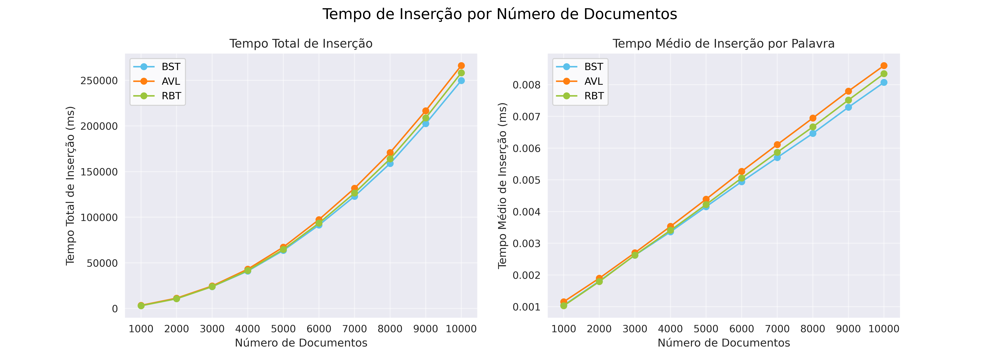

O tempo total de inserção exibe uma curva com **inclinação crescente**, o que é esperado, já que o valor acumulado aumenta com cada operação.

Entre as três estruturas:

- A **BST** apresenta o **menor tempo total de inserção**, pois não realiza rebalanceamento.
- A **AVL** apresenta o **maior tempo**, devido à execução constante de rotações para manter o balanceamento.
- A **RBT** fica em uma posição intermediária, com menos rotações que a AVL, mas com custo estrutural maior que a BST.

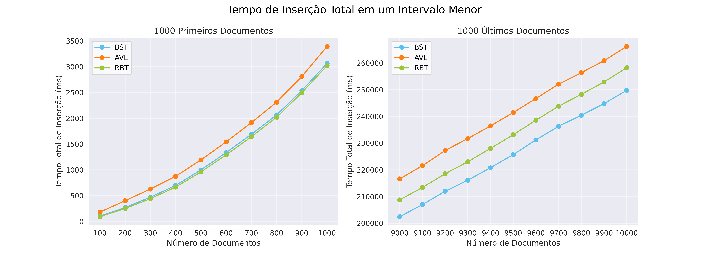
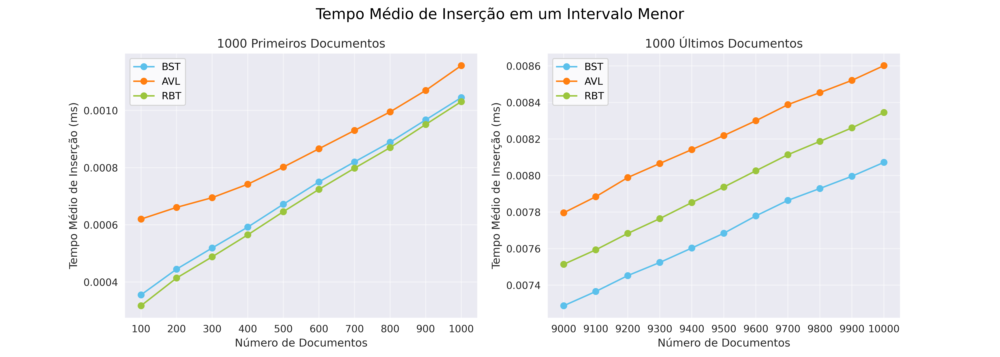

Podemos perceber que desde o início o tempo de inserção da AVL é maior que o das outras duas estruturas, enquanto os tempos da BST e da RBT permanecem bastante próximos. Essa diferença pode ser atribuída a particularidades do banco de dados, que podem causar degeneração na BST e, consequentemente, aumento no seu tempo de inserção. No entanto, considerando os últimos 1000 documentos, quando a árvore está mais completa e balanceada, confirma-se a ordem observada no gráfico anterior: a AVL apresenta o maior tempo de inserção, enquanto a BST mantém o menor

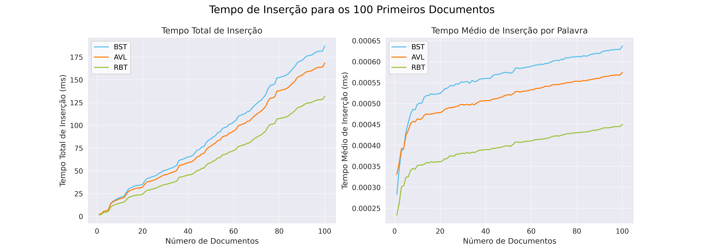

Embora a **BST** continue sendo a estrutura com o maior tempo total de inserção, observa-se um crescimento mais acentuado no tempo médio nas fases finais, o que indica que o aumento da altura da árvore (devido à falta de balanceamento) começou a impactar o desempenho.

A **AVL** segue como a estrutura com o meio tempo total de inserção, confirmando o custo adicional das operações de balanceamento.

A **RBT** tem o tempo menor durante toda a execução, com desempenho melhor que a AVL, mas sem atingir a eficiência crua da BST no tempo de inserção.

### 7.2.4 Tempo de Inserção por vocabulario

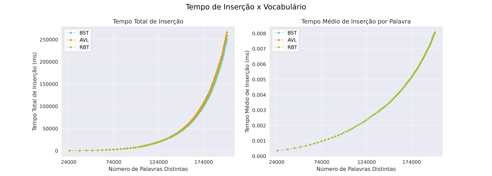
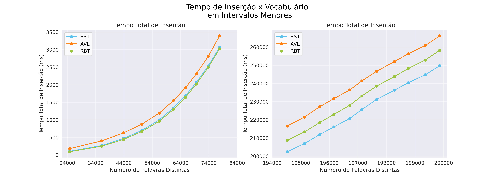

Os gráficos acima mostram o **tempo total de inserção** para as estruturas BST, AVL e RBT, com diferentes intervalos de vocabulário.

- O gráfico à esquerda apresenta os dados em uma escala menor (até 84.000 palavras).
- O gráfico à direita mostra uma faixa mais ampla de palavras distintas (até 200.000).


#### AVL

- **Comportamento esperado:**
  - A AVL realiza **rotações frequentes** para manter o balanceamento, o que **aumenta o custo das inserções**.
  - Espera-se que o tempo de inserção seja maior que nas demais estruturas, visto que a RBT possui uma quantidade menor de rotações.

- **Comportamento observado:**
  - A AVL apresentou o **maior tempo total de inserção** em ambos os intervalos.
  - Isso confirma o comportamento teórico: o alto custo das rotações para manter o balanceamento resulta em inserções mais lentas, especialmente com grandes volumes de dados.

#### RBT

- **Comportamento esperado:**
  - A RBT realiza **menos rotações** que a AVL, mantendo um balanceamento mais flexível.
  - Espera-se que o tempo de inserção seja **menor que o da AVL**, mas **ligeiramente maior que o da BST**.

- **Comportamento observado:**
  - Com até **84.000 palavras distintas**, a RBT apresentou inserções **ligeiramente mais rápidas que a BST**, o que pode ser atribuído a casos específicos de distribuição de dados.
  - No entanto, ao considerar um vocabulário mais amplo (até **200.000 palavras**), a RBT teve desempenho **intermediário**: **mais rápida que a AVL**, mas **mais lenta que a BST**, como previsto teoricamente.

#### BST

- **Comportamento esperado:**
  - Como não realiza rebalanceamento, a BST possui **inserções muito rápidas**, principalmente em entradas aleatórias ou bem distribuídas.
  - É esperado que tenha o **menor tempo de inserção**, apesar do possível custo em busca.

- **Comportamento observado:**
  - A BST apresentou, de fato, o **menor tempo total de inserção** no caso maior.
  - Isso confirma a expectativa: a ausência de rebalanceamento torna a operação de inserção simples e eficiente.

Mesmo com o crescimento do vocabulário, a **BST** manteve o menor tempo total de inserção, confirmando o baixo custo estrutural da operação de inserção.


A **AVL** permaneceu como a estrutura mais lenta em inserção ao longo de toda a amostra, com o tempo total crescendo de forma constante e sempre acima das outras duas estruturas.

À medida que o vocabulário cresceu, a **RBT** se manteve em uma posição intermediária, com desempenho melhor que a AVL, mas inferior à BST, como previsto teoricamente.

### 7.2.5 Tempo de Busca por documento

A seguir, comparamos os tempos de busca observados nos testes com os comportamentos teóricos esperados para cada estrutura de dados:

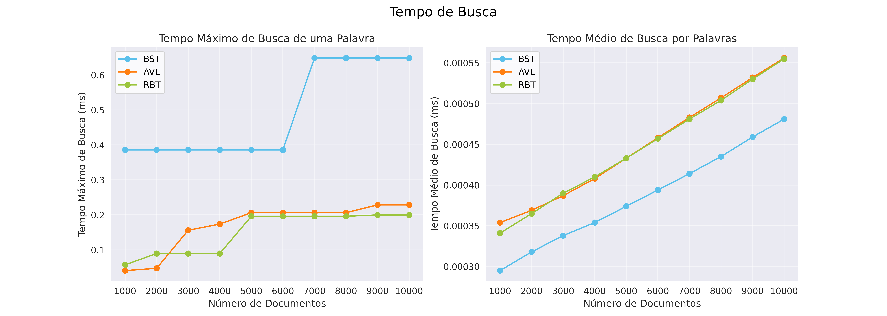

#### BST 

- **Comportamento esperado:**
  - No pior dos casos, a BST pode se degenerar em uma estrutura linear (semelhante a uma lista encadeada), fazendo com que o tempo de busca atinja **O(n)**, como visto anteriormente nesse relatório.

- **Comportamento observado:**
  - O **tempo médio de busca** foi o menor entre as três estruturas, o que indica que muitos termos foram encontrados nos níveis superiores da árvore. Isso não contradiz a teoria: se as árvores fossem balanceadas, haveria uma pequena variação entre o caminho mais curto e o mais longo, o que resultaria em tempos de busca similares para diferentes palavras.
  - No entanto, como a BST **não realiza balanceamento automático**, alguns ramos mais curtos acabam "compensando" o tempo de busca dos ramos mais longos na média geral.
  - Por outro lado, o **tempo máximo de busca** apresentou um **salto brusco** a partir de 6000 documentos, sinalizando **degeneração da estrutura** — exatamente como previsto teoricamente.

#### AVL 

- **Comportamento esperado:**
  - Tempo de busca garantido em **O(log n)**, devido as rotações constantes.
  
- **Comportamento observado:**
  - **Tempo máximo de busca** foi o menor e mais estável dentre todas as estruturas.
  - **Tempo médio** também cresceu de forma controlada, confirmando a **eficiência esperada** da AVL em manter a altura mínima.

#### RBT

- **Comportamento esperado:**
  - O tempo de busca é garantido em **O(log n)** no pior caso, com a altura da árvore limitada a, no máximo, **2·log₂(n)**.
  - A estrutura é **menos rigorosa que a AVL no balanceamento**, mas costuma ser **mais eficiente em inserções e remoções**, devido à sua estratégia de balanceamento mais flexível.

- **Comportamento observado:**
  - Tanto o **tempo máximo** quanto o **tempo médio** de busca foram **estáveis e muito próximos aos valores da AVL**.
  - Embora, teoricamente, se espere um desempenho ligeiramente inferior ao da AVL, **isso não é garantido em todos os casos**, e os resultados observados demonstram que a **RBT pode alcançar desempenho comparável ou equivalente**, especialmente em cenários bem distribuídos.

A fim de observar com maior precisão o comportamento das estruturas nas fases iniciais da construção da árvore, os gráficos abaixo destacam o tempo de busca para os 100 primeiros documentos:

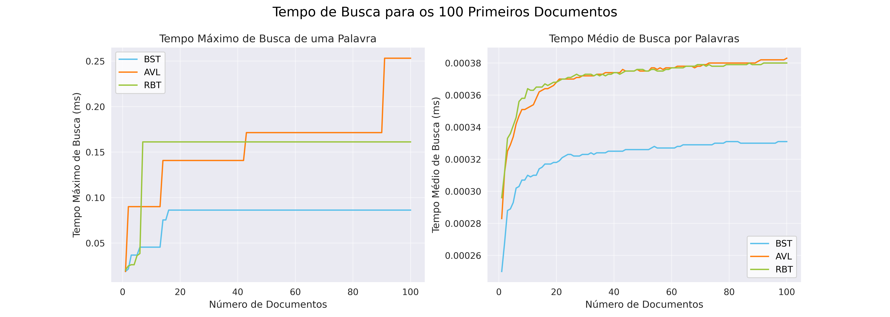

A **BST** apresentou tempos máximos de busca muito baixos e menores que os da AVL e da RBT, estabilizando-se abaixo de 0,1 ms.
Isso pode ocorrer, porque, nas fases iniciais de construção, o tamanho da árvore ainda é pequeno e a degeneração estrutural ainda não acontece.

A **AVL** teve os maiores tempos máximos iniciais, com picos acima de 0,25 ms.
Esses valores podem ser explicados pelo custo das rotações de balanceamento, que são mais frequentes no início da construção da árvore, quando ela ainda está se ajustando a cada nova inserção.

A **RBT** apresentou um crescimento abrupto inicial no tempo máximo de busca, mas rapidamente estabilizou-se em torno de 0,16 ms.
Isso sugere que, durante as primeiras inserções, o balanceamento ainda não tinha atingido um estado estável.

### 7.2.6 Altura

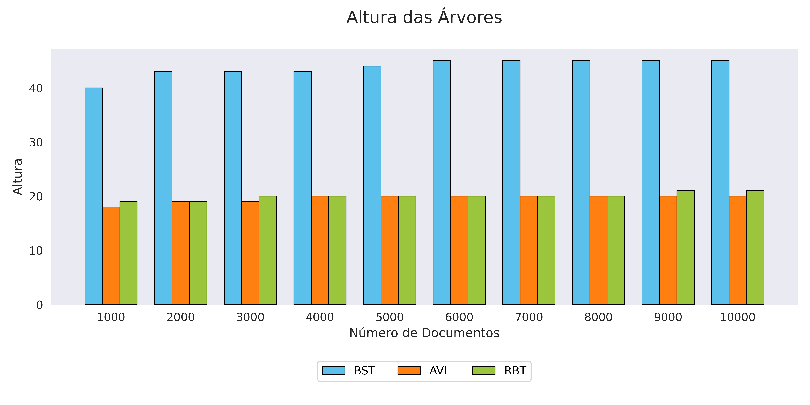

Como já detalhado anteriormente, a altura da **BST** cresce acentuadamente devido à ausência de rebalanceamento.

Tanto a **AVL** quanto a **RBT** são **reajustadas com frequência**, o que ajuda a controlar o crescimento vertical. Contudo, a **AVL apresenta a menor altura** entre todas as árvores, devido ao seu **critério mais rigoroso de balanceamento**, que garante que a diferença de altura entre subárvores nunca exceda 1.

Além disso, é possível notar que a altura das árvores **não cresce de forma acentuada** ao longo do intervalo de 1000 a 10000 documentos. Isso ocorre porque muitas das palavras inseridas ao longo dos documentos **já estavam presentes na árvore**, resultando apenas em atualizações dos nós existentes e não na criação de novos caminhos longos. Como consequência, há **formação de ramos menores e mais distribuídos**, o que reduz a necessidade de expansão vertical significativa.

### 7.2.7 Tamanho do maior e menor galho

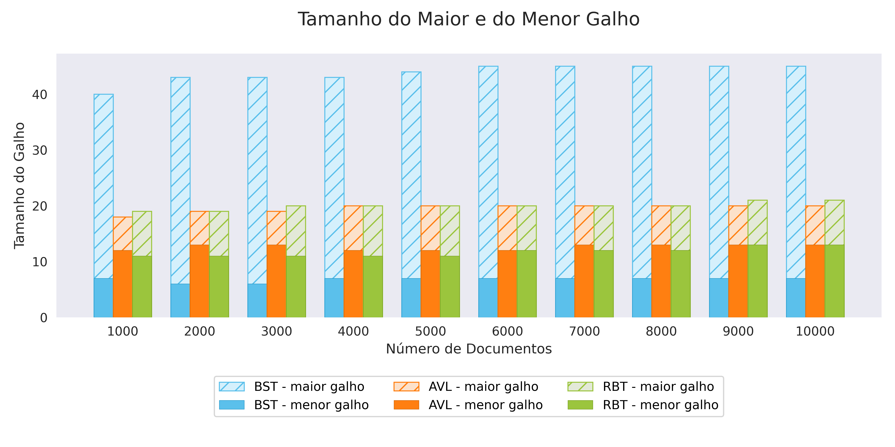

Como a **BST não é rebalanceada**, seu **maior galho tende a ser significativamente mais longo** que o menor. Isso ocorre porque a árvore pode degenerar em certos casos, formando ramos desproporcionalmente profundos.

No gráfico, observamos uma **maior regularidade nos galhos da AVL e da RBT**, estruturas que são rebalanceadas dinamicamente. Porém, há um detalhe importante:

- O **maior galho (altura)** da **AVL nunca é maior que o da RBT**.
- Por outro lado, o **menor galho** da **RBT tende a ser menor que o da AVL**, indicando que a RBT forma caminhos mínimos mais curtos em diversos cenários.

No entanto, essa diferença entre os menores galhos **não é garantida estruturalmente**, e sim uma observação empírica dos dados testados. Em outras palavras, **a RBT pode apresentar galhos mínimos mais curtos**, mas **isso não é uma regra absoluta**.

### 7.2.8 Relação entre o maior e o menor galho

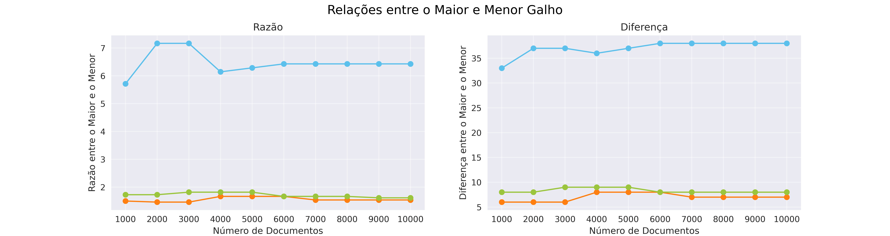

Agora podemos demonstrar matematicamente o comportamento observado no gráfico anterior: como o maior galho da BST é significativamente maior que o menor, tanto a razão quanto a diferença entre esses dois valores são relativamente altas. Em contraste, nas árvores AVL e RBT, que mantêm algum grau de balanceamento, esses valores são consideravelmente menores. É interessante observar também que, como para 6000 documentos a AVL e a RBT tem mesmo tamanho de galhos, para esse número de documentos a razão e a diferença dos dois são iguais.

### 7.2.9 Comparações altura por busca e inserção

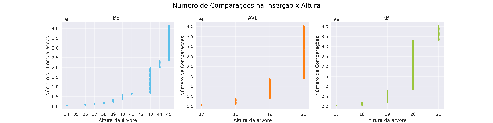


Nos gráficos acima, observamos uma **relação direta entre a altura da árvore** e o **número de comparações realizadas** durante as operações de **inserção** e **busca**.

- A **BST**, com altura atingindo até **45**, confirma seu comportamento **não balanceado**, podendo se assemelhar a uma **lista encadeada** nos piores casos. Esse cenário resulta em **complexidade O(n)** tanto para inserções quanto para buscas.

- A **AVL** mantém a altura entre **17 e 20**, mesmo com um volume elevado de dados. Isso é resultado de seu **balanceamento rigoroso**, que controla o crescimento vertical da árvore ainda que com o custo adicional de rotações frequentes.

- A **RBT** também apresenta uma altura controlada, variando entre **17 e 21**, graças à sua **estratégia de balanceamento mais flexível**. Essa abordagem exige **menos rotações que a AVL**, o que pode resultar em **melhor desempenho prático** em alguns cenários.

### 7.2.10 Comparações

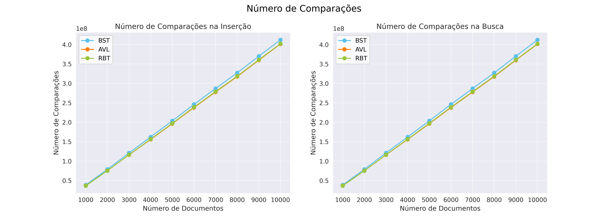

O gráfico acima apresenta o comportamento do **número total de comparações** realizadas à medida que aumenta o número de documentos inseridos.

Como esperado, esse aumento está diretamente ligado ao **crescimento da altura da árvore**, o que impacta diretamente o número de comparações envolvidas nas operações de **busca** e **inserção**.

- A **BST**, cuja altura cresce rapidamente, atinge valores próximos a **45** com **10.000 documentos**, o que a torna altamente desbalanceada. Esse comportamento resulta em um **número de comparações significativamente maior**, conforme visualizado no gráfico.

- Em contrapartida, as estruturas **AVL** e **RBT** mantêm um **crescimento de altura muito mais controlado**, o que reflete diretamente em uma **quantidade menor de comparações**, mesmo nos cenários mais extremos — como nos últimos documentos, onde a árvore está quase cheia e os caminhos já são mais profundos.

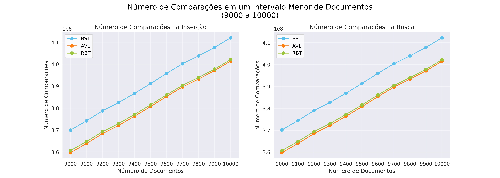

No gráfico acima, o foco está apenas nos **últimos 1000 documentos**, em intervalos de 100, com o objetivo de observar o **comportamento das estruturas sob carga pesada**, quando as árvores já estão mais densas e próximas de sua configuração final.

- É possível notar de forma clara o **distanciamento da BST** em relação às demais, com um **número de comparações muito mais elevado**, reflexo direto de sua estrutura desbalanceada.

- Embora **AVL** e **RBT** apresentem valores próximos, um **detalhe interessante** chama atenção: **esperava-se que a AVL tivesse um desempenho ligeiramente superior**, dado seu **balanceamento mais rigoroso**. Contudo, os dados indicam que a **RBT realizou menos comparações** em alguns cenários.

Essa diferença pode estar relacionada à **organização interna dos dados na base utilizada**. A depender da **ordem das palavras inseridas**, a **estrutura flexível da RBT** pode favorecer a formação de caminhos mais equilibrados. Por outro lado, a AVL pode formar **ramos mais longos que não são completamente compensados** por outros menores, o que leva a um número um pouco maior de comparações.

Apesar disso, ambas as árvores mantêm **desempenho bastante eficiente** em comparação com a BST, validando o uso de **estruturas balanceadas** para aplicações que exigem **buscas e inserções rápidas em grandes volumes de dados**.

### 7.2.11 Altura por Palavras Distintas

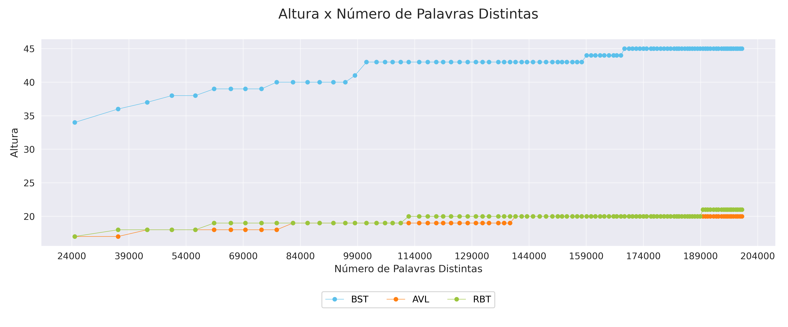

Neste gráfico, analisamos como a altura das três árvores — BST, AVL e RBT — varia à medida que aumenta o número de palavras distintas inseridas.

As árvores analisadas são:

- **BST**: árvore binária de busca simples, sem rebalanceamento  
- **AVL**: árvore balanceada com critério rigoroso  
- **RBT**: árvore com balanceamento mais flexível (vermelho-preto)

No eixo **x**, temos o número de palavras distintas inseridas; no eixo **y**, a **altura da árvore** correspondente.

#### BST

- A altura da BST cresce de forma **quase linear**, refletindo a ausência de balanceamento.
- A **altura máxima observada** foi **45**.
- Sua forma final depende fortemente da **ordem de inserção** dos dados:
  - Se os elementos estiverem ordenados, a árvore se degenera em uma lista encadeada, com altura $h = n$.
  - Em nosso caso, com dados aparentemente aleatórios, o crescimento é mais moderado, mas ainda **instável**.
- Tentamos ajustar uma função linear do tipo $c \cdot n$, mas o ajuste **não foi satisfatório**, o que confirma que o crescimento linear ocorre apenas em **casos extremos**.
- Na prática, sua altura fica entre $\log n$ e $n$, com alta variação.

#### AVL

- A AVL apresenta o **crescimento mais lento e estável**, conforme esperado.
- Teoricamente, sua altura é limitada por cerca de $1{,}44 \cdot \log_2(n)$.
- Ajustamos aos dados uma função da forma $c \cdot \log_2(n)$.

> **Constante estimada**: $c \approx 1{,}143$

- O gráfico mostra excelente aderência à curva logarítmica, confirmando o **controle rígido de altura**.
- **Altura máxima observada**: **20**
- Ideal para aplicações onde a **eficiência de busca** é crítica.

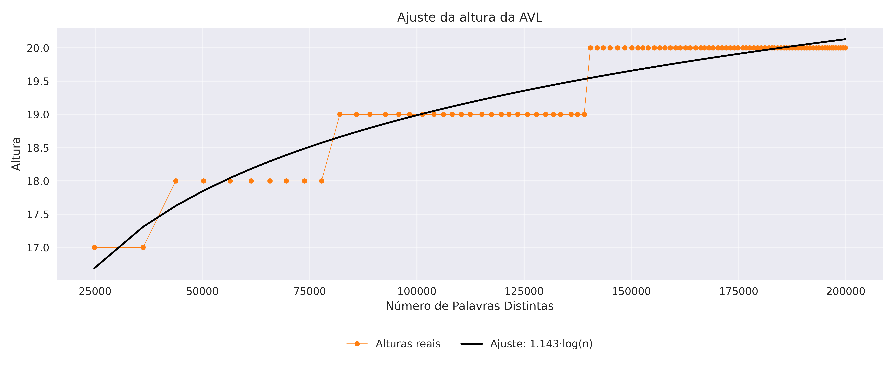

#### RBT

- Também apresenta **crescimento controlado**, com altura ligeiramente superior à AVL.
- Teoricamente, sua altura está limitada por $2 \cdot \log_2(n + 1)$.
- Ajustamos uma função do tipo $c \cdot \log_2(n + 1)$ aos dados:

> **Constante estimada**: $c \approx 1{,}165$

- O ajuste se mostra bastante coerente, validando o **bom desempenho prático** da RBT.
- **Altura máxima observada**: **21**
- Seu **balanceamento mais flexível** favorece **inserções rápidas**, ainda mantendo **buscas eficientes**.

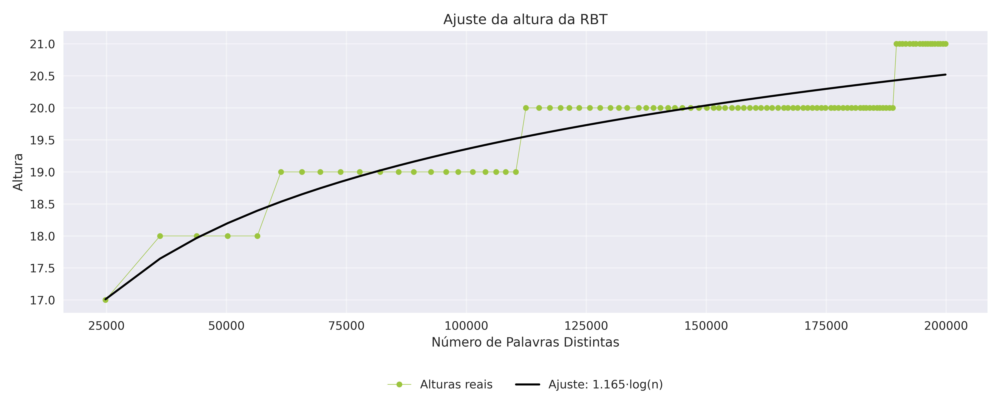

## 8. Análise Comparativa

- **BST**: É a melhor árvore para a incerção, devido à sua estrutura simples e ausência de operações de balanceamento. Porém, por não se balancear, sua altura pode crescer excessivamente em casos desfavoráveis, o que torna o tempo de busca mais imprevisível e, potencialmente, menos eficiente.
- **AVL**: É a árvore com a incerção mais demorada devido ao seu frequente rebalanceamento. No entanto, isso garante um alto grau de balanceamento, o que resulta em alturas menores e mais previsíveis. Por isso, teoricamente, a AVL oferece o melhor desempenho para operações de busca entre as três estruturas.
- **RBT**: Tem um tempo de inserção intermediário, pois realiza rebalanceamentos de forma mais eficiente e menos frequente que a AVL. Seu balanceamento é menos rigoroso, o que resulta em uma altura maior que a da AVL, mas ainda significativamente menor e mais estável que a da BST. Assim, a RBT representa um bom compromisso entre custo de inserção e desempenho nas operações de busca.

Na inserção, como era esperado, a AVL apresenta o pior desempenho desde o início, devido aos rebalanceamentos frequentes, enquanto a BST tem o melhor desempenho por não realizar nenhum tipo de balanceamento. A RBT, por adotar um critério de balanceamento menos rigoroso, inicia com um tempo de inserção muito próximo ao da BST; no entanto, à medida que a árvore cresce, seu desempenho se estabiliza em um nível intermediário entre outras duas árvores.
Na operação de busca, como era esperado, o tempo máximo da BST foi bem maior que o das outras duas, cujos tempos se mostraram bastante semelhantes. No entanto, o tempo médio de busca contrariou as expectativas, sendo menor na BST. Isso provavelmente ocorreu pois, devido à ausência de balanceamento, a árvore apresenta muitos galhos curtos, o que faz com que as buscas por palavras nesses ramos compensem, em média, o custo elevado das buscas nos galhos mais profundos.

## 9. Dificuldades Encontradas

Inicialmente, enfrentamos desafios na definição da estrutura de dados ideal para armazenar as palavras extraídas dos documentos. Após discutir diferentes abordagens, decidimos criar uma struct chamada docs, contendo o ID do documento e um vetor com todos os termos extraídos.

Na BST, tivemos dificuldades para calcular corretamente a altura da árvore, o que foi solucionado com a implementação da função `recomputeHeightTree`.

Para a AVL, encontramos uma grande dificuldade em entender o comportamento do balanceamento da árvore como um todo. Em especial, nos questionamos se a diferença entre o maior e o menor galho (ou seja, entre as profundidades das folhas mais distantes) poderia ser maior do que 1. Isso, pois, a regra fundamental da AVL exige que, para todo nó, a diferença entre as alturas de suas subárvores esquerda e direita seja no máximo 1. No entanto, essa condição é local: ela se aplica a cada nó individualmente, e não à árvore inteira. Assim, é possível que a diferença entre o caminho mais curto e o mais longo da árvore exceda 1, desde que todos os nós intermediários respeitem o fator de balanceamento definido. Por exemplo,

```mathematica
          ●
        /   \
      ●       ●
     / \     /  \
    ●   ●   ●    ●
   /       / \    \
  ●       ●   ●    ●
         / \
        ●   ●
```

uma arvore balanceada com galho menor 3 e galho maior 5.

Na RBT, a função `fixUp` representou o maior obstáculo, exigindo um bom entendimento dos casos em que rotações e trocas de cor devem ser aplicadas para preservar as propriedades da árvore rubro-negra.

Quanto à CLI, a principal dificuldade esteve na estruturação da lógica de funcionamento, principalmente no tratamento de erros e na validação de argumentos. Foi necessário implementar verificações para evitar argumentos inválidos, comandos desconhecidos ou diretórios inexistentes.

## 10. Conclusão

Ao longo deste trabalho, exploramos a implementação de um índice invertido utilizando três estruturas de dados baseadas em árvores binárias: a Árvore Binária de Busca (BST), a Árvore AVL e a Árvore Rubro-Negra (RBT). Também analisamos e comparamos o desempenho dessas estruturas em diversos aspectos, como tempo de inserção, tempo de busca, altura e número de comparações, utilizando diferentes conjuntos de dados.

A partir dos resultados obtidos, algumas observações importantes podem ser destacadas:

    A BST, embora simples e fácil de implementar, apresenta como principal desvantagem a possibilidade de degeneração da árvore, o que compromete a eficiência das operações de busca e remoção;

    A AVL é a estrutura mais eficiente em termos de balanceamento, o que garante um tempo de busca mais estável. No entanto, esse rigor no balanceamento implica um custo maior nas operações de inserção;

    A RBT apresentou um comportamento intermediário: mais equilibrada que a BST e menos complexa que a AVL. Isso pode resultar em um melhor desempenho prático, especialmente em cenários com grande volume de dados.

De forma geral, a escolha da estrutura ideal depende diretamente do contexto da aplicação. Para sistemas mais simples, a BST pode ser suficiente. Já para mecanismos de busca e sistemas de recuperação da informação que lidam com grandes volumes de dados e realizam operações frequentes de inserção e consulta, a AVL ou a RBT são opções mais adequadas — sendo a RBT frequentemente preferida em ambientes de produção, devido à sua robustez, desempenho estável e flexibilidade.

Por fim, foi especialmente interessante observar, na prática, uma aplicação concreta das estruturas de árvore no contexto de um índice invertido, evidenciando a importância desses conceitos na área de estruturas de dados e recuperação da informação.

## 11. Referências

[1] GeeksforGeeks. *Inverted Index*. Disponível em: [https://www.geeksforgeeks.org/inverted-index/](https://www.geeksforgeeks.org/inverted-index/). Acesso em: 16 jun. 2025.

[2] Wikipedia. *Inverted index*. Disponível em: [https://en.wikipedia.org/wiki/Inverted_index](https://en.wikipedia.org/wiki/Inverted_index). Acesso em: 16 jun. 2025.


---

> **Data de Entrega:** 18/06/2025  
> **Professor:** Matheus Werner 
> **Disciplina:** Estrutura de dados
